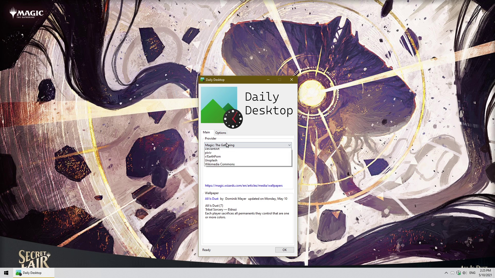

    

Modular Windows desktop wallpaper updater that works daily at a set time. Wallpapers are provided by [IProvider](/DailyDesktop.Core/Providers/IProvider.cs) classes that are implemented in DLL modules. For example, look at [/DailyDesktop.Providers.MTG/](/DailyDesktop.Providers.MTG/), which takes wallpaper from the official Wizards of the Coast [website for Magic: The Gathering wallpaper](https://magic.wizards.com/en/articles/media/wallpapers).

This program is based on [a previous C# program I wrote](https://github.com/goodtrailer/MTG-Wallpaper-OTW) that only worked specifically for Magic: The Gathering, and was not remotely user-friendly. The original idea is based off of KDE Plasma's daily wallpaper addon/plugin where options included [Bing](https://www.bing.com), [Wikimedia Commons](https://commons.wikimedia.org/wiki/Commons:Picture_of_the_day), and [National Geographic](https://www.nationalgeographic.com/photo-of-the-day).

## Video Showcase (YouTube)

## Developing a Provider Module
To develop your own Daily Desktop provider modules, use the [NuGet package](https://www.nuget.org/packages/goodtrailer.DailyDesktop.Core/):
* PackageManager: `Install-Package goodtrailer.DailyDesktop.Core`
* dotnet: `dotnet add package goodtrailer.DailyDesktop.Core`

Then, implement the [IProvider](/DailyDesktop.Core/Providers/IProvider.cs) interface in a *public* class. For examples, check these [providers I already implemented](#implemented).

#### Debugging
Wallpapers are actually downloaded/applied by DailyDesktop.Task. To debug a provider module, build and run DailyDesktop.Task in `Debug` mode and pass it the arguments `"path\to\provider.dll" --json "path\to\info-output.json" --blur 40`. The `--blur 40` is optional and the value can be changed between 0 to 100. Arguments can be passed through `DailyDesktop.Task > Properties > Debug` in Visual Studio.

## Providers
#### Implemented
* Bing @ [/DailyDesktop.Providers.Bing/](/DailyDesktop.Providers.Bing/)
* Calvin and Hobbes @ [/DailyDesktop.Providers.CalvinAndHobbes/](/DailyDesktop.Providers.CalvinAndHobbes/)
* DeviantArt @ [/DailyDesktop.Providers.DeviantArt/](/DailyDesktop.Providers.DeviantArt/)
* False Knees @ [/DailyDesktop.Providers.FalseKnees/](/DailyDesktop.Providers.FalseKnees/)
* ~~Magic: The Gathering~~ (Deprecated) @ [/archived/DailyDesktop.Providers.MTG/](/archived/DailyDesktop.Providers.MTG/)
* Pixiv @ [/DailyDesktop.Providers.Pixiv/](/DailyDesktop.Providers.Pixiv/)
* Pokémon TCG @ [/DailyDesktop.Providers.Pokemon/](/DailyDesktop.Providers.Pokemon/)
* r/EarthPorn (SFW) @ [/DailyDesktop.Providers.RedditEarthPorn/](/DailyDesktop.Providers.RedditEarthPorn/)
* Unsplash @ [/DailyDesktop.Providers.Unsplash/](/DailyDesktop.Providers.Unsplash/)
* Wikimedia Commons @ [/DailyDesktop.Providers.WikimediaCommons/](/DailyDesktop.Providers.WikimediaCommons/)

## Blurred-fit Mode
Daily Desktop has an optional "blurred-fit" mode that fits the entire image within the wallpaper, then fills in the background with a blurred and enlarged version of the image itself, instead of using a solid color like Windows does. This is useful if a provider's source contains images that are of a vastly different aspect ratio to your primary display.

*Image credit:* [真夏に花が咲く](https://www.pixiv.net/en/artworks/88058753)*, illustrated by* [ロシロイチ](https://www.pixiv.net/en/users/2712686)
| Original | Blurred-fit: 0.40 |
| -------- | ----------------- |
|  |  |

| Windows 10 Fill | Windows 10 Fit |
| --------------- | -------------- |
|  |  |

## Third-Party Libraries
* **[MIT]** [mdymel/superfastblur](https://github.com/mdymel/superfastblur) used @ [/DailyDesktop.Task/](/DailyDesktop.Task/)
